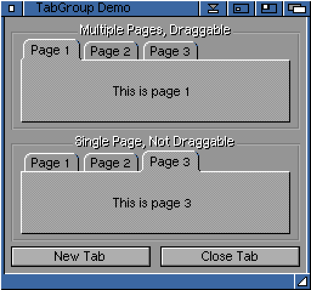

# MCC_TabGroup

TabGroup.mcc is an enhanced version of [MUI](https://en.wikipedia.org/wiki/Magic_User_Interface)'s built-in Register class.
It is useful for applications which manage multiple projects per window
and wish to show one per page.

Key features:

- Tabs can be added, removed, renamed, and dragged/dropped
- Display one page per tab, or the same page on all tabs
- Mimics the look and feel of the Register class
- User preferences for tab size, padding, font, and background

## Screenshot

## Installation

Unpack the LhA archive from Aminet and run the installer:
https://aminet.net/package/dev/mui/MCC_TabGroup
